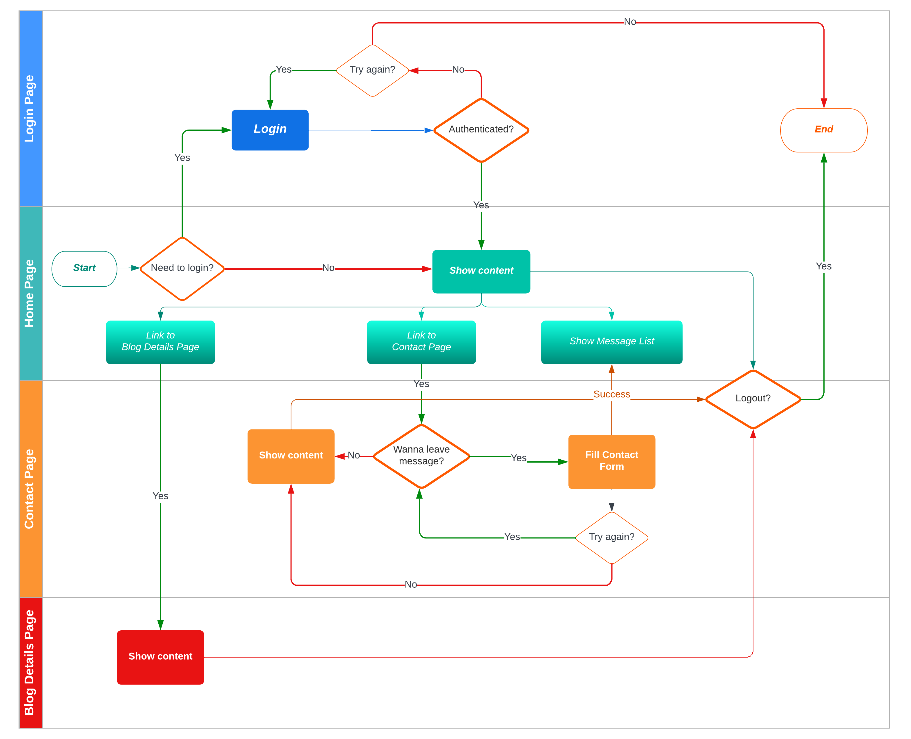

# NEXTJS PRACTICE ONE

## OVERVIEW

- This document provides a detailed estimation of the NextJS Practice 1

## LIVE DEMO

- [https://yoora-webapp.vercel.app/](https://yoora-webapp.vercel.app/)
- Login information:
  - Email: guest@api.com
  - Pass: Guest@123

## TARGETS

- Apply new features of NextJS 13:
  - App directory
  - Next.config.js (compress, responsive images)
  - Layout, Error, Template
  - Using all components: Link, Script (apply Partytown), Head
  - Using different fetching strategy (static, server, client)
  - API routes
- PageSpeed score is mandatory minimum 98

## TECHNICAL

- [NextJS (v13+)](https://beta.nextjs.org/docs/routing/pages-and-layouts): A flexible React framework that gives you building blocks to create fast web applications.
- [React (v18+)](https://reactjs.org/docs/getting-started.html): A JavaScript library for building user interfaces.
- [Typescript 4.9.4](https://www.typescriptlang.org/): TypeScript is an open-source language which builds on JavaScript, one of the world’s most used tools, by adding static type definitions.
- [ChakraUI](https://chakra-ui.com/getting-started/vite-guide): Chakra UI is a simple, modular and accessible component library that gives you the building blocks you need to build your React applications.
- [CSS module](https://github.com/css-modules/css-modules): A CSS Module is a CSS file in which all class names and animation names are scoped locally by default.
- [Storybook](https://storybook.js.org/blog/get-started-with-storybook-and-next-js/): Storybook is an open source tool for building UI components and pages in isolation. It streamlines UI development, testing, and documentation.
- [Jest ^29.3.1](https://jestjs.io/docs/getting-started)
- [React Testing Library ^13.4.0](https://testing-library.com/docs/react-testing-library/intro/): Simple and complete testing utilities that encourage good testing practices. Is a light-weight solution for testing web pages by querying and interacting with DOM nodes.
- [SWR](https://swr.vercel.app/docs/with-nextjs): SWR is a strategy to first return the data from cache (stale), then send the fetch request (revalidate), and finally come with the up-to-date data.
- [Husky ^8.0.2](https://github.com/typicode/husky): Husky improves your commits and more 🐶 woof!
- [Lint-staged ^13.1.0](https://github.com/okonet/lint-staged): Linting makes more sense when run before committing your code.
- Deploy with [Vercel](https://vercel.com/)

## MEASURING APP PERFORMANCE TOOLS

- [Lighthouse](https://chrome.google.com/webstore/detail/lighthouse/blipmdconlkpinefehnmjammfjpmpbjk): Lighthouse is an open-source, automated tool for improving the performance, quality, and correctness of your web apps.
- [PageSpeed](https://pagespeed.web.dev/): reports on the performance of a page on both mobile and desktop devices, and provides suggestions on how that page may be improved.

## DEVELOPER TOOLS

- pnpm 7.22.0
- node 17.3.0
- eslint 8.31.0
- prettier ^2.8.1

## TEAM SIZE

- 1 dev

## REQUIREMENTS

Build Yoora web app with pages:

- Login page
- Home page:
  - Hero section
  - Brands section
  - Benefit section
  - Features section
  - Integrations section
  - What’s new section
  - Revenue section
  - Feedback section (click on item of **What's new at Yoora?** to navigate to Blog details page)
  - CTA section
- Blog details page
- Contact page (no need integrate map)
  - After submitting a form, displaying the new message on Feedback section of Home page

## TIMELINE:

- Estimated time: 12 working days

## DESIGN

- [UI](https://www.figma.com/file/vxpGwXCoCTOmemQ77z9UYB/Yoora-CMS?node-id=0%3A1&t=gG0lec31ZWhLvMPW-0)

## APP'S WORKFLOW



## GETTING STARTED

- Before running below commands, please add .env file with this value:

```
 NEXT_PUBLIC_BASE_URL=...
 SECURE_TOKEN=...
```

- All commands are run from the root folder, from a terminal:

| **Command**                                              | **Action**                                        |
| :------------------------------------------------------- | :------------------------------------------------ |
| `git@gitlab.asoft-python.com:uyen.ho/react-training.git` | Clone project from Gitlab                         |
| `git checkout nextjs`                                    | Switch to nextjs branch                           |
| `cd yoora-webapp`                                        | Move to yoora-webapp folder                       |
| `pnpm install`                                           | Install dependencies                              |
| `pnpm dev`                                               | Start local dev server at `localhost:3000`        |
| `pnpm build`                                             | Create an optimized production build              |
| `pnpm start`                                             | Start local production server at `localhost:3000` |
| `pnpm storybook`                                         | Start storybook dev at `localhost:6006`           |
| `pnpm build-storybook`                                   | Build storybook                                   |
| `pnpm lint:fix`                                          | Run eslint check code before commit               |
| `pnpm test`                                              | Testing application                               |
| `pnpm coverage`                                          | Testing application and get coverage              |
